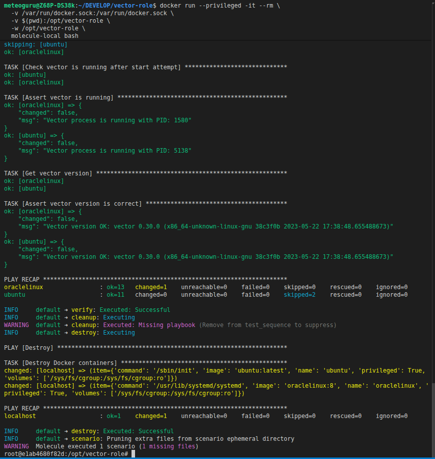

### 1. Собрать образ из Dockerfile.molecule

Находясь в корне проекта:


```
docker build -t molecule-local -f Dockerfile.molecule .
```

После сборки:


```
docker images | grep molecule-local
```

Ты увидишь:


```
molecule-local   latest   <id>   <size>
```

Теперь команда:


```
docker run --privileged -it --rm \
  -v /var/run/docker.sock:/var/run/docker.sock \
  -v $(pwd):/opt/vector-role \
  -w /opt/vector-role \
  molecule-local bash
```


## Проверка

После запуска контейнера:


```
molecule --version
```

и затем:


```
molecule test
```


## Можно упростить запуск

Сделать alias:


```
alias mol='docker run --privileged -it --rm \
  -v /var/run/docker.sock:/var/run/docker.sock \
  -v $(pwd):/opt/vector-role \
  -w /opt/vector-role \
  molecule-local'
```

Теперь запуск:


```
mol bash
```

